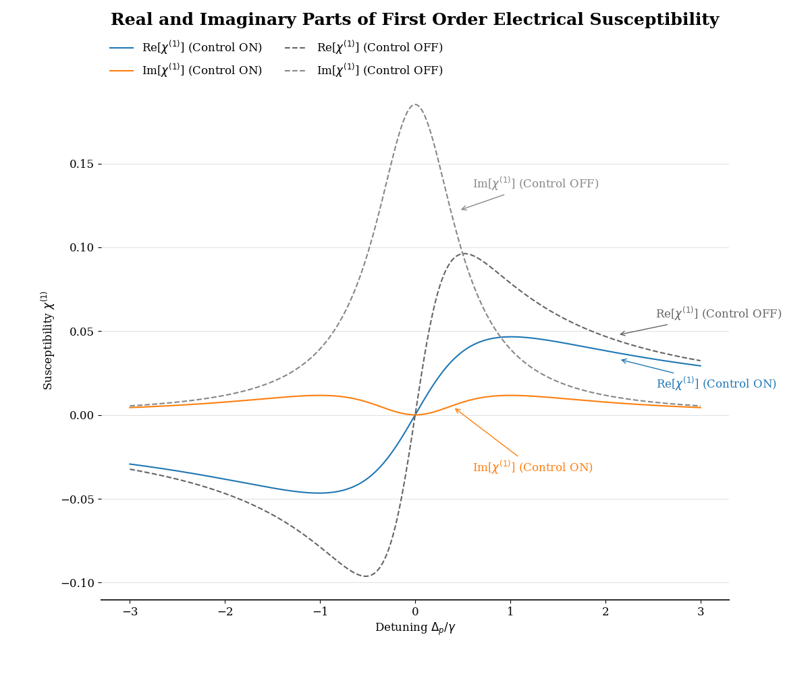
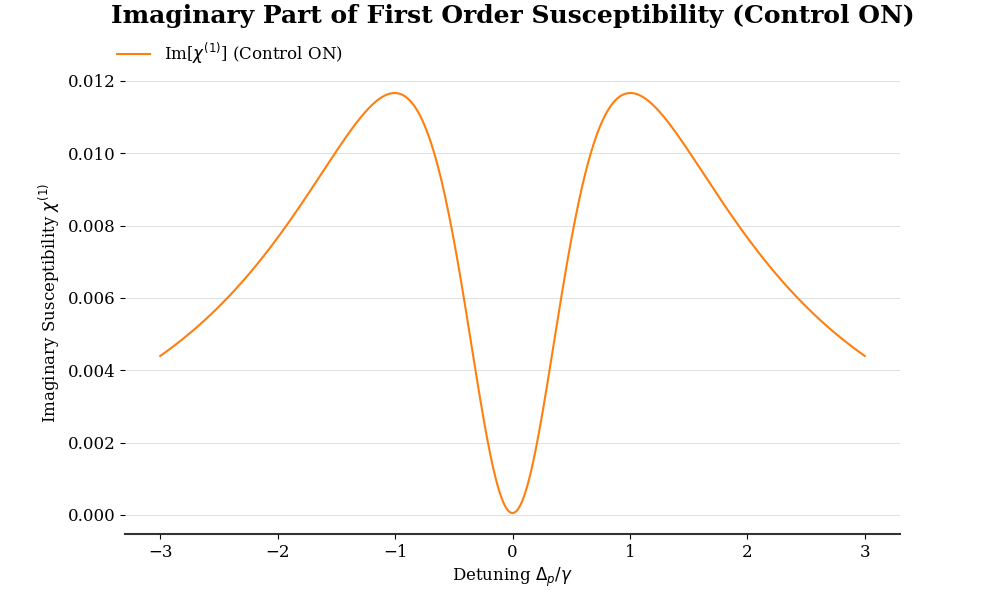

# Electromagnetically Induced Transparency (EIT): Simulation and Visualization

This project hosts a simulation of Electromagnetically Induced Transparency (EIT) as well as the final visualization of the real and imaginary part of the first-order electrical susceptibility. This repository belongs to the BSc thesis. The scheme proposed in the EIT is a three-level quantum optics system in Lambda configuration.

## Table of Contents

- [Features](#features)
- [Project Structure](#project-structure)
- [Installation](#installation)
- [Usage](#usage)
- [Configuration](#configuration)
- [Example](#example)
- [Licence](#licence)
- [Contact](#contact)

## Features

- Numerical simulation of EIT based on the Lindblad equation.
- Visualization of real and imaginary part of the first-order susceptibility.
- Conda environment to provide a replicable framework.

## Project Structure

- `src/`: Contains the simulation code and calculations.
  - `calculations.py`: Defines the EIT calculations.
- `plots/`: Contains plotting and visualization tools.
  - `plot_config.py`: Configures the plot styles.
  - `plot_generator.py`: Generates the plots.
- `doc/`: Documentation for the project.
- `environment.yml`: Conda environment file.
- `main.py`: Entry point for running the project.

## Installation

Run:

```bash
conda env create -f environment.yml
conda activate eit_env
```

## Usage

Run:

```python
python main.py
```

## Configuration

The user can experimentally adjust the simulation parameters in `src/config.py` file. The user can provide different values for the decay rates, Rabi frequencies, or detuning values.

## Example

<p style="text-align: center;">
  
</p>
<p style="text-align: center;">
  
</p>

## Licence

This project is licensed under the same terms as the BSc thesis it is derived from. Please refer to the thesis documentation for specific licensing details and any applicable restrictions.

## Contact

For questions or suggestions related specifically to this thesis, please contact:

- Name: Ricard Santiago Raigada García
- Email: <rraigadag@uoc.edu>
