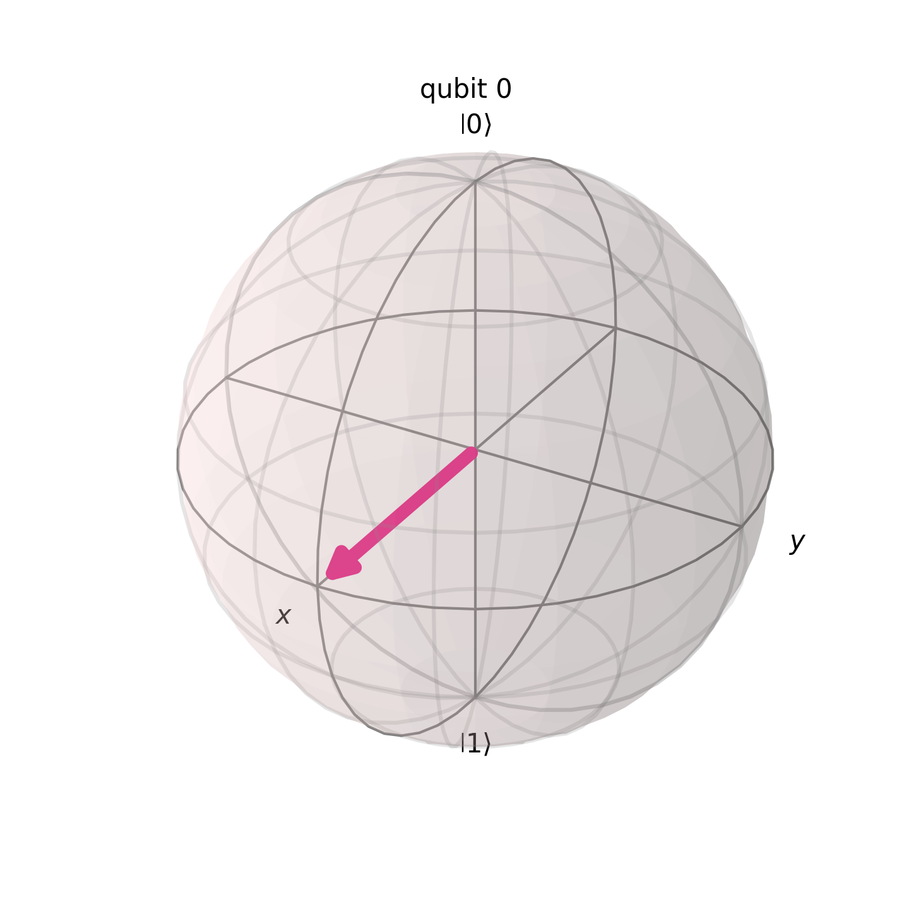
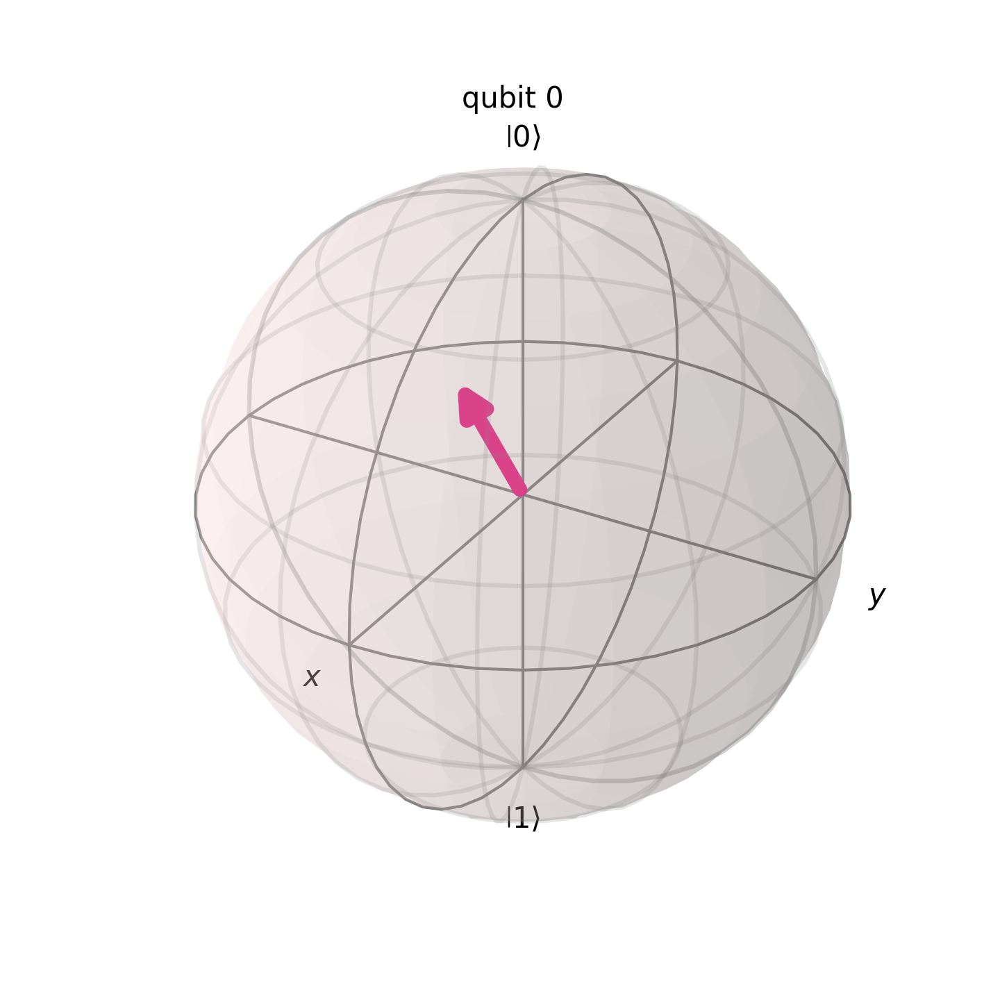
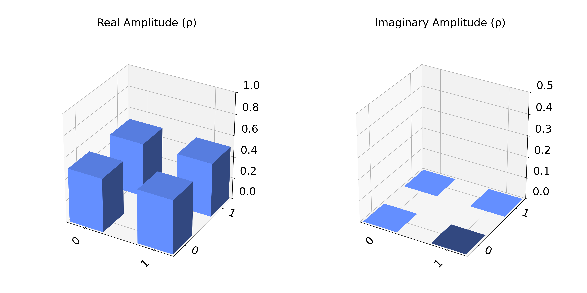
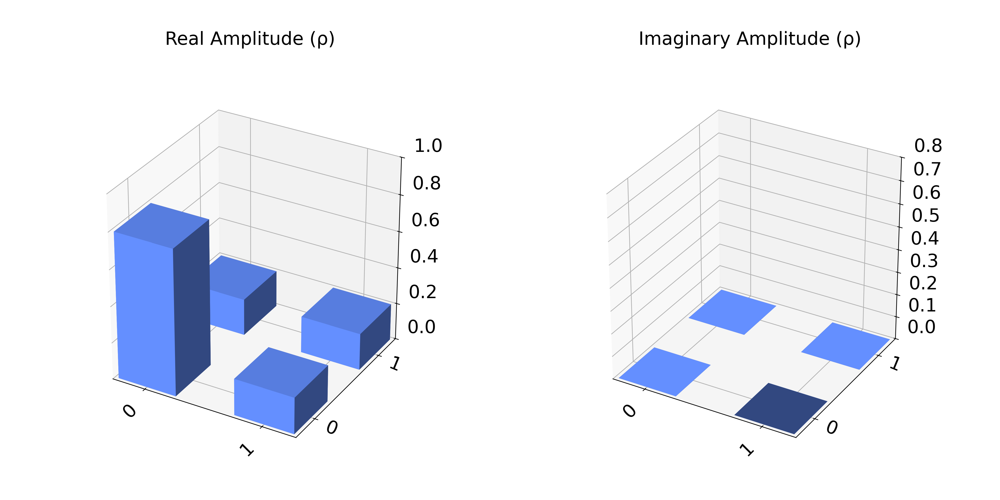
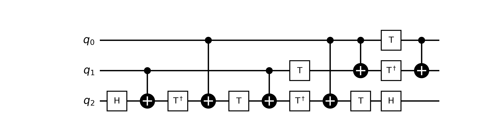

# Visualization and Decomposition of Quantum Gates

## Description

This directory contains the code that generates Figures A.7 and A.8 in the body of the BsC thesis. The scripts generate visualizations of the density matrices and the Bloch sphere representation for both a pure state and a mixed state.

## Table of Contents

- [Project Structure](#project-structure)
- [Installation](#installation)
- [Usage](#usage)
- [Licence](#licence)
- [Contact](#contact)

## Project Structure

- `Toffoli_visualization.py`:
  - Script that decomposes the Toffoli gate (CCNOT) into basic quantum gates.
  - Generates a black and white diagram of the decomposition and saves it as `toffoli_decomposed_bw.png`.

- `Bloch_visualization.py`:
- Script that generates visualizations of:
  - Pure and mixed states on the Bloch sphere.
  - 3D density matrix representations.
- Expected outputs:
  - `Bloch_pure_state.png`: Representation of a pure state.
  - `Bloch_mixed_state.png`: Representation of a mixed state.
  - `Density_pure_state.png`: Density matrix of the pure state.
  - `Density_mixed_state.png`: Density matrix of the mixed state.

## Installation

Requirements:

1. Python 3.8+
2. Dependencies:
   - [Qiskit](https://qiskit.org/documentation/getting_started.html)
   - [Matplotlib](https://matplotlib.org/stable/users/explain/quick_start.html)

Install dependencies using `pip`:

```bash
pip install qiskit matplotlib
```

## Usage

### 1. Visualization of the Toffoli Gate

Run the script:

```bash
python Toffoli_visualization.py
```

The image will be generated as `toffoli_decomposed_bw.png`.

### 2. States on the Bloch Sphere and Density Matrix

Run the script:

```bash
python Bloch_visualization.py
```

Generated files:

- `Bloch_pure_state.png`
- `Bloch_mixed_state.png`
- `Density_pure_state.png`
- `Density_mixed_state.png`

## Visualizations

1. Bloch Sphere:

<div style="display: flex; flex-wrap: wrap; justify-content: space-between;"> <div style="width: 48%;"> <p><b>Pure state (`Bloch_pure_state.png`):</b></p>  </div> <div style="width: 48%;"> <p><b>Mixed state (`Bloch_mixed_state.png`):</b></p>  </div> </div>

2. Density matrix:

<div style="display: flex; flex-wrap: wrap; justify-content: space-between;"> <div style="width: 48%;"> <p><b>Pure state (`Density_pure_state.png`):</b></p>  </div> <div style="width: 48%;"> <p><b>Mixed state (`Density_mixed_state.png`):</b></p>  </div> </div>

3. Decomposition of the Toffoli Gate:

<div style="text-align: center;"> <p><b>`toffoli_decomposed_bw.png`:</b></p>  </div>

## Licence

This project is licensed under the same terms as the BSc thesis it is derived from. Please refer to the thesis documentation for specific licensing details and any applicable restrictions.

## Contact

For questions or suggestions related specifically to this thesis, please contact:

- Name: Ricard Santiago Raigada García
- Email: <rraigadag@uoc.edu>
